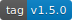
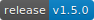
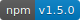
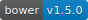
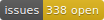

<!DOCTYPE html>
<!-- saved from url=(0042)https://pandao.github.io/editor.md/en.html -->
<html lang="en" class=" js flexbox flexboxlegacy canvas canvastext webgl no-touch geolocation postmessage websqldatabase indexeddb hashchange history draganddrop websockets rgba hsla multiplebgs backgroundsize borderimage borderradius boxshadow textshadow opacity cssanimations csscolumns cssgradients cssreflections csstransforms csstransforms3d csstransitions fontface generatedcontent video audio localstorage sessionstorage webworkers applicationcache svg inlinesvg smil svgclippaths"><head><meta http-equiv="Content-Type" content="text/html; charset=UTF-8">
        
		<meta http-equiv="X-UA-Compatible" content="IE=edge">
        <meta http-equiv="Cache-Control" content="no-siteapp">
		<meta name="renderer" content="webkit">
		<meta name="viewport" content="width=device-width, initial-scale=1, maximum-scale=1, user-scalable=no">
        <meta name="keywords" content="Editor.md,editor,Markdown Editor,Markdown,编辑器,Markdown编辑器,Markdown在线编辑器,在线编辑器,开源编辑器,开源Markdown编辑器">
        <meta name="description" content="Editor.md: a simple online markdown editor. 开源在线 Markdown 编辑器">
	    <meta name="author" content="pandao, pandao@vip.qq.com">
        <title>Editor.md - Open source online Markdown editor.</title>
        <link rel="shortcut icon" href="https://pandao.github.io/editor.md/favicon.ico" type="image/x-icon">
        <link rel="stylesheet" type="text/css" href="./README_files/planeui.min.css">
        <link rel="stylesheet" href="./README_files/editormd.min.css">
        <link rel="stylesheet" type="text/css" href="./README_files/index.css">
    <link type="text/css" rel="stylesheet" href="./README_files/codemirror.min.css"><link type="text/css" rel="stylesheet" href="./README_files/dialog.css"><link type="text/css" rel="stylesheet" href="./README_files/matchesonscrollbar.css"><link type="text/css" rel="stylesheet" href="./README_files/foldgutter.css"><link type="text/css" rel="stylesheet" href="./README_files/katex.min.css"></head>
    <body>
        
        
        

            <header class="pui-bg-blue page-header">
                

                    <h1 class="pui-text-center pui-text-xxxxxl page-title animated zoomInDown">
                        <a href="https://pandao.github.io/editor.md/index.html" class="pui-text-white">
                            <i class="editormd-logo editormd-logo-2x"></i><strong>Editor.md</strong>
                        </a>
                    </h1>
                    
Open source online Markdown editor.

                    <menu class="pui-text-center page-menu animated zoomInDown">
                        <ul class="pui-menu pui-menu-inline pui-menu-radius">
                            <li>
                                <a href="https://pandao.github.io/editor.md/en.html#download"><i class="fa fa-cloud-download"></i> Download</a>
                            </li>
                            <li>
                                <a href="http://editor.md.ipandao.com/examples/index.html"><i class="fa fa-flask"></i> Examples <i class="pui-arrow-down"></i></a>
                                <ul class="pui-menu pui-menu-dropdown pui-z-depth-2">
                                    <li>
                                        <a href="http://editor.md.ipandao.com/examples/simple.html">Simple example</a>
                                    </li>
                                    <li>
                                        <a href="http://editor.md.ipandao.com/examples/full.html">Full example</a>
                                    </li>
                                    <li>
                                        <a href="http://editor.md.ipandao.com/examples/html-preview-markdown-to-html.html">Markdown To HTML</a>
                                    </li>
                                    <li>
                                        <a href="http://editor.md.ipandao.com/examples/form-get-value.html">Get value on Form</a>
                                    </li>
                                    <li class="has-submenu">
                                        <a href="javascript:;">Markdown Extras</a>
                                        <ul class="pui-menu pui-menu-dropdown pui-z-depth-2">
                                            <li>
                                                <a href="http://editor.md.ipandao.com/examples/toc.html">ToC (Table of Contents)</a>
                                            </li>
                                            <li>
                                                <a href="http://editor.md.ipandao.com/examples/task-lists.html">GFM task lists</a>
                                            </li>
                                            <li>
                                                <a href="http://editor.md.ipandao.com/examples/emoji.html">Emoji</a>
                                            </li>
                                            <li>
                                                <a href="http://editor.md.ipandao.com/examples/@links.html">@Links</a>
                                            </li>
                                            <li>
                                                <a href="http://editor.md.ipandao.com/examples/katex.html">TeX (KaTeX)</a>
                                            </li>
                                            <li>
                                                <a href="http://editor.md.ipandao.com/examples/flowchart.html">FlowChart</a>
                                            </li>
                                            <li>
                                                <a href="http://editor.md.ipandao.com/examples/sequence-diagram.html">Sequence diagram</a>
                                            </li>
                                            <li>
                                                <a href="http://editor.md.ipandao.com/examples/html-tags-decode.html">HTML tags decode</a>
                                            </li>
                                        </ul>
                                    </li>
                                    <li class="has-submenu">
                                        <a href="javascript:;">Custom Editor.md</a>
                                        <ul class="pui-menu pui-menu-dropdown pui-z-depth-2">
                                            <li>
                                                <a href="http://editor.md.ipandao.com/examples/define-plugin.html">Define plugin</a>
                                            </li>
                                            <li>
                                                <a href="http://editor.md.ipandao.com/examples/themes.html">Custom editor theme</a>
                                            </li>
                                            <li>
                                                <a href="http://editor.md.ipandao.com/examples/custom-toolbar.html">Custom toolbar</a>
                                            </li>
                                            <li>
                                                <a href="http://editor.md.ipandao.com/examples/custom-keyboard-shortcuts.html">Custom keyboard shortcuts</a>
                                            </li>
                                            <li>
                                                <a href="http://editor.md.ipandao.com/examples/change-mode.html">Change mode</a>
                                            </li>
                                            <li>
                                                <a href="http://editor.md.ipandao.com/examples/manually-load-modules.html">Manually load modules</a>
                                            </li>
                                            <li>
                                                <a href="http://editor.md.ipandao.com/examples/multi-editormd.html">Multi Editor.md</a>
                                            </li>
                                            <li>
                                                <a href="http://editor.md.ipandao.com/examples/readonly.html">Read only mode</a>
                                            </li>
                                            <li>
                                                <a href="http://editor.md.ipandao.com/examples/code-fold.html">Code fold</a>
                                            </li>
                                            <li>
                                                <a href="http://editor.md.ipandao.com/examples/sync-scrolling.html">Bisync / Single sync scrolling</a>
                                            </li>
                                            <li>
                                                <a href="http://editor.md.ipandao.com/examples/external-use.html">External using method</a>
                                            </li>
                                            <li>
                                                <a href="http://editor.md.ipandao.com/examples/multi-languages.html">Multi-languages</a>
                                            </li>
                                            <li>
                                                <a href="http://editor.md.ipandao.com/examples/auto-height.html">Auto height</a>
                                            </li>
                                            <li>
                                                <a href="http://editor.md.ipandao.com/examples/dynamic-create-editormd.html">Dynamic create Editor.md</a>
                                            </li>
                                            <li>
                                                <a href="http://editor.md.ipandao.com/examples/search-replace.html">Search / Replace</a>
                                            </li>
                                            <li>
                                                <a href="http://editor.md.ipandao.com/examples/set-get-replace-selection.html">Insert value, Set/Get/Replace selection text</a>
                                            </li>
                                        </ul>
                                    </li>
                                    <li class="has-submenu">
                                        <a href="javascript:;">Event handle</a>
                                        <ul class="pui-menu pui-menu-dropdown pui-z-depth-2">
                                            <li>
                                                <a href="http://editor.md.ipandao.com/examples/on-off.html">On / Off (bind/unbind)</a>
                                            </li>
                                            <li>
                                                <a href="http://editor.md.ipandao.com/examples/onload.html">Onload</a>
                                            </li>
                                            <li>
                                                <a href="http://editor.md.ipandao.com/examples/onchange.html">Onchange</a>
                                            </li>
                                            <li>
                                                <a href="http://editor.md.ipandao.com/examples/onresize.html">Onresize</a>
                                            </li>
                                            <li>
                                                <a href="http://editor.md.ipandao.com/examples/onfullscreen.html">Onfullscreen / OnfullscreenExit</a>
                                            </li>
                                            <li>
                                                <a href="http://editor.md.ipandao.com/examples/onpreviewing-onpreviewed.html">Onpreviewing / Onpreviewed</a>
                                            </li>
                                            <li>
                                                <a href="http://editor.md.ipandao.com/examples/onwatch-onunwatch.html">Onwatch / Onunwatch</a>
                                            </li>
                                            <li>
                                                <a href="http://editor.md.ipandao.com/examples/onscroll-onpreviewscroll.html">Onscroll / Onpreviewscroll</a>
                                            </li>
                                        </ul>
                                    </li>
                                    <li class="has-submenu">
                                        <a href="javascript:;">Image upload</a>
                                        <ul class="pui-menu pui-menu-dropdown pui-z-depth-2">
                                            <li>
                                                <a href="http://editor.md.ipandao.com/examples/image-upload.html">Same domain upload</a>
                                            </li>
                                            <li>
                                                <a href="http://editor.md.ipandao.com/examples/image-cross-domain-upload.html">Cross-domain upload</a>
                                            </li>
                                        </ul>
                                    </li>
                                    <li class="has-submenu">
                                        <a href="javascript:;">Using Require.js, Sea.js, Zepto.js</a>
                                        <ul class="pui-menu pui-menu-dropdown pui-z-depth-2">
                                            <li>
                                                <a href="http://editor.md.ipandao.com/examples/use-requirejs.html">Using Require.js</a>
                                            </li>
                                            <li>
                                                <a href="http://editor.md.ipandao.com/examples/use-seajs.html">Using Sea.js</a>
                                            </li>
                                            <li>
                                                <a href="http://editor.md.ipandao.com/examples/use-zepto.html">Using Zepto.js</a>
                                            </li>
                                        </ul>
                                    </li>
                                    <li>
                                        <a href="http://editor.md.ipandao.com/examples/index.html">More...</a>
                                    </li>
                                </ul>
                            </li>
                            <li>
                                <a href="https://pandao.github.io/editor.md/en.html#dependents"><i class="fa fa-gears"></i> Dependents</a>
                            </li>
                            <li>
                                <a href="https://pandao.github.io/editor.md/en.html#license"><i class="fa fa-check"></i> License</a>
                            </li>
                            <li>
                                <a href="https://github.com/pandao/editor.md/blob/master/CHANGE.md" target="_blank"><i class="fa fa-refresh"></i> Changes</a>
                            </li>
                            <li>
                                <a href="https://github.com/pandao/editor.md/issues" target="_blank"><i class="fa fa-question-circle"></i> Issues</a>
                            </li>
                            <li>
                                <a href="https://github.com/pandao/editor.md" target="_blank"><i class="fa fa-github"></i> Github</a>
                            </li>
                            <li>
                                <a href="https://gitee.com/pandao/editor.md" target="_blank"><i class="fa fa-git"></i> Git@OSC</a>
                            </li>
                            <li>
                                <a href="https://pandao.github.io/editor.md/index.html"><i class="fa fa-language"></i> 中文版</a>
                            </li>
                        </ul>
                    </menu>   
                    

                        
<textarea class="editormd-markdown-textarea" placeholder="Enjoy Markdown! coding now..." name="index-editormd-markdown-doc" style="display: none;"># ИЗ ЧЕГО СОСТОИТ ОСУП?
ОСУП включает в себя 58 шаблонов управленческих документов и делится на части по следующим перекрывающим друг друга срезам:

## Процессы управления проектами. 
Комплекты шаблонов для 5-ти основных процессов УП:
-  группа процессов инициации:
###### Группа процессов инициации состоит из процессов, которые выполняются для определения нового проекта или новой фазы существующего проекта путем получения разрешения для начала нового проекта или фазы. В рамках процессов инициации определяются изначальные цели и содержание, и фиксируются изначальные финансовые ресурсы. Определяются внутренние и внешние заинтересованные стороны проекта, которые будут взаимодействовать и влиять на общий результат проекта. Выбирается менеджер проекта, если он еще не назначен. Данная информация закрепляется в Уставе проекта и в Реестре заинтересованных сторон проекта. После утверждения Устава проекта считается, что проект официально авторизирован.
-  группа процессов планирования:
###### Группа процессов планирования состоит из процессов, осуществляемых для определения общего содержания работ, постановки и уточнения целей и разработки последовательности действий, требуемых для достижения данных целей. Процессы планирования разрабатывают План управления проектом и Документацию проекта, которые будут использованы для выполнения проекта.
-  группа процессов исполнения:
###### Группа процессов исполнения состоит из процессов, применяемых для выполнения работ, определенных в Плане управления проектом, для осуществления целей проекта. Эта группа включает в себя координацию людей и ресурсов, а так же интеграцию и выполнение операций проекта в соответствии с Планом управления проектом.
-  группа процессов мониторинга и управления:
###### Группа процессов мониторинга и управления состоит из процессов, требуемых для отслеживания, анализа и регулирования хода и эффективности выполнения проекта, выявления тех областей, в которых требуется внесение изменений в План, и инициации соответствующих изменений. Основное назначение данной группы процессов состоит в том, что наблюдение за выполнением проекта и его измерение производится регулярно и тщательно, с тем чтобы выявить отклонения от Плана управления проектом.
-  группа процессов завершения:
###### Группа процессов завершения состоит из процессов, выполняемых для завершения всех операций в рамках всех групп процессов управления проектом для формального завершения проекта, фазы и контрактных обязательств. Данная группа процессов подтверждает, что процессы, определенные в рамках всех групп процессов, выполнены необходимым образом для завершения проекта или фазы проекта, и формально устанавливает, что проект или фаза проекта завершена.
## Области знаний УП.
-  управление интеграцией проекта:
###### Управление интеграцией проекта включает в себя процессы и действия, необходимые для определения, уточнения, комбинирования, объединения и координации различных процессов и действия по управлению проектом в рамках групп процессов управления проектом.
-  управление содержанием проекта:
###### Управление содержанием проекта включает в себя процессы, требуемые для обеспечения того, чтобы проект содержал все и только те работы, которые требуются для успешного завершения проекта.
-  управление сроками проекта:
###### Управление сроками проекта включает в себя процессы, необходимые для того, чтобы обеспечить своевременное завершение проекта.
-  управление стоимостью проекта:
###### Управление стоимостью проекта включает в себя процессы, необходимые для оценки, разработки бюджета и контроля расходов, обеспечивающего исполнение проекта в рамках утвержденного бюджета.
-  управление качеством проекта:
###### Управление качеством проекта включает в себя процессы и действия исполняющей организации, которые определяют политики в области качества, цели и ответственность таким образом, чтобы проект удовлетворял тем потребностям, ради которых он был предпринят.
-  управление человеческими ресурсами проекта:
###### Управление человеческими ресурсами проекта включает в себя процессы организации и управления командой проекта.
-  управление коммуникациями проекта:
###### Управление коммуникациями проекта включает в себя процессы, необходимые для обеспечения своевременного формирования, сбора, распределения, хранения, нахождения и использования проектной информации.
-  управление рисками проекта:
###### Управление рисками проекта включает в себя процессы, связанные с осуществлением планирования управления рисками, выявлением, анализом, реагированием, а так же мониторингом и контролем рисков в проекте.
-  управление закупками проекта:
###### Управление закупками проекта включает в себя процессы покупки или приобретения необходимых для осуществления проекта продуктов, услуг или результатов вне команды проекта.
-  управление заинтересованными сторонами проекта:
###### Управление заинтересованными сторонами проекта включает в себя процессы, необходимые для выявления всех людей или организаций, на которых влияет проект, анализа ожиданий заинтересованных сторон и их влияния на проект, а также разработки соответствующих управленческих стратегий для эффективного вовлечения заинтересованных сторон в принятие решений и исполнение проекта.
## Папки шаблонов для УП.
-  документы проекта:
###### Чтобы разъяснить взаимодействия процессов, были добавлены блок-схемы данных. Это позволило определить источник на входе и пункт назначения на выходе каждого процесса. План управления проектом и Документы проекта стали более дифференцированными. Это позволило обозначить вспомогательные и базовые планы как главные элементы Плана управления проектом. Хотя Документы проекта используются для того, чтобы помочь менеджеру проекта управлять им, они не являются частью Плана управления проектом.
-  план управления проектом:
###### План управления проектом. Утвержденный формальный документ, в котором указано, как проект будет исполняться, как будет происходить его мониторинг и управление им. План может быть обобщенным или подробным, а так же может включать один или несколько вспомогательных планов управления и другие документы по планированию.
-  документация по закупкам:
###### Документация по закупкам — документы, используемые в мероприятиях по сбору цен и предложений, которые включают в себя приглашение от покупателя на участие в конкурсе, Приглашение к переговорам, Запрос информации, Запрос на коммерческое предложение, Запрос предложений и ответов продавцов.
-  коммуникации проекта:
###### Процесс Контроля коммуникаций включает в себя мероприятия, которые необходимы для создания, распространения, получения, подтверждения и понимания информации. Коммуникации проекта могут включать, но не ограничиваются: отчёты об исполнении, статусы результатов, прогресс расписания и понесенные затраты. Коммуникации проекта могут существенно различаться и зависит от таких факторов, как (но не ограничиваясь этим) срочность и влияние сообщения, способ его доставки и уровень конфиденциальности.
-  базовый план исполнения:
###### Базовый план исполнения. Одобренный объединенный план работ проекта по содержанию, расписанию и стоимости, с которым сравнивается текущее исполнение проекта для измерения и управления исполнением. Базовый план также может включать технические параметры и параметры качества.
-  расписание проекта:
###### Расписание проекта. Выход модели расписания, представляющий взаимосвязанные операции с запланированными датами, длительностями, контрольными событиями и ресурсами.</textarea>

<textarea autocorrect="off" autocapitalize="off" spellcheck="false" style="position: absolute; padding: 0px; width: 1000px; height: 1em; outline: none;" tabindex="0"></textarea>

<pre>x</pre>

29

<pre>###End</pre>

&nbsp;

22

<pre class="">###### Управление сроками проекта включает в себя процессы, необходимые для того, чтобы обеспечить своевременное завершение проекта.</pre>

23

<pre class="">-  управление стоимостью проекта:</pre>

24

<pre class="">###### Управление стоимостью проекта включает в себя процессы, необходимые для оценки, разработки бюджета и контроля расходов, обеспечивающего исполнение проекта в рамках утвержденного бюджета.</pre>

25

<pre class="">-  управление качеством проекта:</pre>

26

<pre class="">###### Управление качеством проекта включает в себя процессы и действия исполняющей организации, которые определяют политики в области качества, цели и ответственность таким образом, чтобы проект удовлетворял тем потребностям, ради которых он был предпринят.</pre>

27

<pre class="">-  управление человеческими ресурсами проекта:</pre>

28

<pre class="">###### Управление человеческими ресурсами проекта включает в себя процессы организации и управления командой проекта.</pre>

29

<pre class="">-  управление коммуникациями проекта:</pre>

30

<pre class="">###### Управление коммуникациями проекта включает в себя процессы, необходимые для обеспечения своевременного формирования, сбора, распределения, хранения, нахождения и использования проектной информации.</pre>

31

<pre class="">-  управление рисками проекта:</pre>

32

<pre class="">###### Управление рисками проекта включает в себя процессы, связанные с осуществлением планирования управления рисками, выявлением, анализом, реагированием, а так же мониторингом и контролем рисков в проекте.</pre>

33

<pre class="">-  управление закупками проекта:</pre>

34

<pre class="">###### Управление закупками проекта включает в себя процессы покупки или приобретения необходимых для осуществления проекта продуктов, услуг или результатов вне команды проекта.</pre>

35

<pre class="">-  управление заинтересованными сторонами проекта:</pre>

36

<pre class="">###### Управление заинтересованными сторонами проекта включает в себя процессы, необходимые для выявления всех людей или организаций, на которых влияет проект, анализа ожиданий заинтересованных сторон и их влияния на проект, а также разработки соответствующих управленческих стратегий для эффективного вовлечения заинтересованных сторон в принятие решений и исполнение проекта.</pre>

37

<pre class="">## Папки шаблонов для УП.</pre>

38

<pre class="">-  документы проекта:</pre>

39

<pre class="">###### Чтобы разъяснить взаимодействия процессов, были добавлены блок-схемы данных. Это позволило определить источник на входе и пункт назначения на выходе каждого процесса. План управления проектом и Документы проекта стали более дифференцированными. Это позволило обозначить вспомогательные и базовые планы как главные элементы Плана управления проектом. Хотя Документы проекта используются для того, чтобы помочь менеджеру проекта управлять им, они не являются частью Плана управления проектом.</pre>

40

<pre class="">-  план управления проектом:</pre>

41

<pre class="">###### План управления проектом. Утвержденный формальный документ, в котором указано, как проект будет исполняться, как будет происходить его мониторинг и управление им. План может быть обобщенным или подробным, а так же может включать один или несколько вспомогательных планов управления и другие документы по планированию.</pre>

42

<pre class="">-  документация по закупкам:</pre>

43

<pre class="">###### Документация по закупкам — документы, используемые в мероприятиях по сбору цен и предложений, которые включают в себя приглашение от покупателя на участие в конкурсе, Приглашение к переговорам, Запрос информации, Запрос на коммерческое предложение, Запрос предложений и ответов продавцов.</pre>

44

<pre class="">-  коммуникации проекта:</pre>

45

<pre class="">###### Процесс Контроля коммуникаций включает в себя мероприятия, которые необходимы для создания, распространения, получения, подтверждения и понимания информации. Коммуникации проекта могут включать, но не ограничиваются: отчёты об исполнении, статусы результатов, прогресс расписания и понесенные затраты. Коммуникации проекта могут существенно различаться и зависит от таких факторов, как (но не ограничиваясь этим) срочность и влияние сообщения, способ его доставки и уровень конфиденциальности.</pre>

46

<pre class="">-  базовый план исполнения:</pre>

47

<pre class="">###### Базовый план исполнения. Одобренный объединенный план работ проекта по содержанию, расписанию и стоимости, с которым сравнивается текущее исполнение проекта для измерения и управления исполнением. Базовый план также может включать технические параметры и параметры качества.</pre>

48

<pre class="">-  расписание проекта:</pre>

49

<pre>###### Расписание проекта. Выход модели расписания, представляющий взаимосвязанные операции с запланированными датами, длительностями, контрольными событиями и ресурсами.</pre>

<h1 id="h1--">ИЗ ЧЕГО СОСТОИТ ОСУП?</h1>
ОСУП включает в себя 58 шаблонов управленческих документов и делится на части по следующим перекрывающим друг друга срезам:

<h2 id="h2--">Процессы управления проектами.</h2>
Комплекты шаблонов для 5-ти основных процессов УП:

<ul>
<li>группа процессов инициации:<h6 id="h6--"><a name="Группа процессов инициации состоит из процессов, которые выполняются для определения нового проекта или новой фазы существующего проекта путем получения разрешения для начала нового проекта или фазы. В рамках процессов инициации определяются изначальные цели и содержание, и фиксируются изначальные финансовые ресурсы. Определяются внутренние и внешние заинтересованные стороны проекта, которые будут взаимодействовать и влиять на общий результат проекта. Выбирается менеджер проекта, если он еще не назначен. Данная информация закрепляется в Уставе проекта и в Реестре заинтересованных сторон проекта. После утверждения Устава проекта считается, что проект официально авторизирован." class="reference-link"></a>Группа процессов инициации состоит из процессов, которые выполняются для определения нового проекта или новой фазы существующего проекта путем получения разрешения для начала нового проекта или фазы. В рамках процессов инициации определяются изначальные цели и содержание, и фиксируются изначальные финансовые ресурсы. Определяются внутренние и внешние заинтересованные стороны проекта, которые будут взаимодействовать и влиять на общий результат проекта. Выбирается менеджер проекта, если он еще не назначен. Данная информация закрепляется в Уставе проекта и в Реестре заинтересованных сторон проекта. После утверждения Устава проекта считается, что проект официально авторизирован.</h6></li><li>группа процессов планирования:<h6 id="h6--">Группа процессов планирования состоит из процессов, осуществляемых для определения общего содержания работ, постановки и уточнения целей и разработки последовательности действий, требуемых для достижения данных целей. Процессы планирования разрабатывают План управления проектом и Документацию проекта, которые будут использованы для выполнения проекта.</h6></li><li>группа процессов исполнения:<h6 id="h6--">Группа процессов исполнения состоит из процессов, применяемых для выполнения работ, определенных в Плане управления проектом, для осуществления целей проекта. Эта группа включает в себя координацию людей и ресурсов, а так же интеграцию и выполнение операций проекта в соответствии с Планом управления проектом.</h6></li><li>группа процессов мониторинга и управления:<h6 id="h6--">Группа процессов мониторинга и управления состоит из процессов, требуемых для отслеживания, анализа и регулирования хода и эффективности выполнения проекта, выявления тех областей, в которых требуется внесение изменений в План, и инициации соответствующих изменений. Основное назначение данной группы процессов состоит в том, что наблюдение за выполнением проекта и его измерение производится регулярно и тщательно, с тем чтобы выявить отклонения от Плана управления проектом.</h6></li><li>группа процессов завершения:<h6 id="h6--">Группа процессов завершения состоит из процессов, выполняемых для завершения всех операций в рамках всех групп процессов управления проектом для формального завершения проекта, фазы и контрактных обязательств. Данная группа процессов подтверждает, что процессы, определенные в рамках всех групп процессов, выполнены необходимым образом для завершения проекта или фазы проекта, и формально устанавливает, что проект или фаза проекта завершена.</h6><h2 id="h2--">Области знаний УП.</h2></li><li>управление интеграцией проекта:<h6 id="h6--">Управление интеграцией проекта включает в себя процессы и действия, необходимые для определения, уточнения, комбинирования, объединения и координации различных процессов и действия по управлению проектом в рамках групп процессов управления проектом.</h6></li><li>управление содержанием проекта:<h6 id="h6--">Управление содержанием проекта включает в себя процессы, требуемые для обеспечения того, чтобы проект содержал все и только те работы, которые требуются для успешного завершения проекта.</h6></li><li>управление сроками проекта:<h6 id="h6--">Управление сроками проекта включает в себя процессы, необходимые для того, чтобы обеспечить своевременное завершение проекта.</h6></li><li>управление стоимостью проекта:<h6 id="h6--">Управление стоимостью проекта включает в себя процессы, необходимые для оценки, разработки бюджета и контроля расходов, обеспечивающего исполнение проекта в рамках утвержденного бюджета.</h6></li><li>управление качеством проекта:<h6 id="h6--">Управление качеством проекта включает в себя процессы и действия исполняющей организации, которые определяют политики в области качества, цели и ответственность таким образом, чтобы проект удовлетворял тем потребностям, ради которых он был предпринят.</h6></li><li>управление человеческими ресурсами проекта:<h6 id="h6--">Управление человеческими ресурсами проекта включает в себя процессы организации и управления командой проекта.</h6></li><li>управление коммуникациями проекта:<h6 id="h6--">Управление коммуникациями проекта включает в себя процессы, необходимые для обеспечения своевременного формирования, сбора, распределения, хранения, нахождения и использования проектной информации.</h6></li><li>управление рисками проекта:<h6 id="h6--">Управление рисками проекта включает в себя процессы, связанные с осуществлением планирования управления рисками, выявлением, анализом, реагированием, а так же мониторингом и контролем рисков в проекте.</h6></li><li>управление закупками проекта:<h6 id="h6--">Управление закупками проекта включает в себя процессы покупки или приобретения необходимых для осуществления проекта продуктов, услуг или результатов вне команды проекта.</h6></li><li>управление заинтересованными сторонами проекта:<h6 id="h6--">Управление заинтересованными сторонами проекта включает в себя процессы, необходимые для выявления всех людей или организаций, на которых влияет проект, анализа ожиданий заинтересованных сторон и их влияния на проект, а также разработки соответствующих управленческих стратегий для эффективного вовлечения заинтересованных сторон в принятие решений и исполнение проекта.</h6><h2 id="h2--">Папки шаблонов для УП.</h2></li><li>документы проекта:<h6 id="h6--"><a name="Чтобы разъяснить взаимодействия процессов, были добавлены блок-схемы данных. Это позволило определить источник на входе и пункт назначения на выходе каждого процесса. План управления проектом и Документы проекта стали более дифференцированными. Это позволило обозначить вспомогательные и базовые планы как главные элементы Плана управления проектом. Хотя Документы проекта используются для того, чтобы помочь менеджеру проекта управлять им, они не являются частью Плана управления проектом." class="reference-link"></a>Чтобы разъяснить взаимодействия процессов, были добавлены блок-схемы данных. Это позволило определить источник на входе и пункт назначения на выходе каждого процесса. План управления проектом и Документы проекта стали более дифференцированными. Это позволило обозначить вспомогательные и базовые планы как главные элементы Плана управления проектом. Хотя Документы проекта используются для того, чтобы помочь менеджеру проекта управлять им, они не являются частью Плана управления проектом.</h6></li><li>план управления проектом:<h6 id="h6--">План управления проектом. Утвержденный формальный документ, в котором указано, как проект будет исполняться, как будет происходить его мониторинг и управление им. План может быть обобщенным или подробным, а так же может включать один или несколько вспомогательных планов управления и другие документы по планированию.</h6></li><li>документация по закупкам:<h6 id="h6--">Документация по закупкам — документы, используемые в мероприятиях по сбору цен и предложений, которые включают в себя приглашение от покупателя на участие в конкурсе, Приглашение к переговорам, Запрос информации, Запрос на коммерческое предложение, Запрос предложений и ответов продавцов.</h6></li><li>коммуникации проекта:<h6 id="h6--"><a name="Процесс Контроля коммуникаций включает в себя мероприятия, которые необходимы для создания, распространения, получения, подтверждения и понимания информации. Коммуникации проекта могут включать, но не ограничиваются: отчёты об исполнении, статусы результатов, прогресс расписания и понесенные затраты. Коммуникации проекта могут существенно различаться и зависит от таких факторов, как (но не ограничиваясь этим) срочность и влияние сообщения, способ его доставки и уровень конфиденциальности." class="reference-link"></a>Процесс Контроля коммуникаций включает в себя мероприятия, которые необходимы для создания, распространения, получения, подтверждения и понимания информации. Коммуникации проекта могут включать, но не ограничиваются: отчёты об исполнении, статусы результатов, прогресс расписания и понесенные затраты. Коммуникации проекта могут существенно различаться и зависит от таких факторов, как (но не ограничиваясь этим) срочность и влияние сообщения, способ его доставки и уровень конфиденциальности.</h6></li><li>базовый план исполнения:<h6 id="h6--">Базовый план исполнения. Одобренный объединенный план работ проекта по содержанию, расписанию и стоимости, с которым сравнивается текущее исполнение проекта для измерения и управления исполнением. Базовый план также может включать технические параметры и параметры качества.</h6></li><li>расписание проекта:<h6 id="h6--">Расписание проекта. Выход модели расписания, представляющий взаимосвязанные операции с запланированными датами, длительностями, контрольными событиями и ресурсами.</h6></li></ul>

<ul class="editormd-menu"><li><a href="javascript:;" title="Undo(Ctrl+Z)" unselectable="on"><i class="fa fa-undo" name="undo" unselectable="on"></i></a></li><li><a href="javascript:;" title="Redo(Ctrl+Y)" unselectable="on"><i class="fa fa-repeat" name="redo" unselectable="on"></i></a></li><li class="divider" unselectable="on">|</li><li><a href="javascript:;" title="Bold" unselectable="on"><i class="fa fa-bold" name="bold" unselectable="on"></i></a></li><li><a href="javascript:;" title="Strikethrough" unselectable="on"><i class="fa fa-strikethrough" name="del" unselectable="on"></i></a></li><li><a href="javascript:;" title="Italic" unselectable="on"><i class="fa fa-italic" name="italic" unselectable="on"></i></a></li><li><a href="javascript:;" title="Block quote" unselectable="on"><i class="fa fa-quote-left" name="quote" unselectable="on"></i></a></li><li><a href="javascript:;" title="Words first letter convert to uppercase" unselectable="on"><i class="fa" name="ucwords" style="font-size:20px;margin-top: -3px;">Aa</i></a></li><li><a href="javascript:;" title="Selection text convert to uppercase" unselectable="on"><i class="fa fa-font" name="uppercase" unselectable="on"></i></a></li><li><a href="javascript:;" title="Selection text convert to lowercase" unselectable="on"><i class="fa" name="lowercase" style="font-size:24px;margin-top: -10px;">a</i></a></li><li class="divider" unselectable="on">|</li><li><a href="javascript:;" title="Heading 1" unselectable="on"><i class="fa editormd-bold" name="h1" unselectable="on">H1</i></a></li><li><a href="javascript:;" title="Heading 2" unselectable="on"><i class="fa editormd-bold" name="h2" unselectable="on">H2</i></a></li><li><a href="javascript:;" title="Heading 3" unselectable="on"><i class="fa editormd-bold" name="h3" unselectable="on">H3</i></a></li><li><a href="javascript:;" title="Heading 4" unselectable="on"><i class="fa editormd-bold" name="h4" unselectable="on">H4</i></a></li><li><a href="javascript:;" title="Heading 5" unselectable="on"><i class="fa editormd-bold" name="h5" unselectable="on">H5</i></a></li><li><a href="javascript:;" title="Heading 6" unselectable="on"><i class="fa editormd-bold" name="h6" unselectable="on">H6</i></a></li><li class="divider" unselectable="on">|</li><li><a href="javascript:;" title="Unordered list" unselectable="on"><i class="fa fa-list-ul" name="list-ul" unselectable="on"></i></a></li><li><a href="javascript:;" title="Ordered list" unselectable="on"><i class="fa fa-list-ol" name="list-ol" unselectable="on"></i></a></li><li><a href="javascript:;" title="Horizontal rule" unselectable="on"><i class="fa fa-minus" name="hr" unselectable="on"></i></a></li><li class="divider" unselectable="on">|</li><li><a href="javascript:;" title="Link" unselectable="on"><i class="fa fa-link" name="link" unselectable="on"></i></a></li><li><a href="javascript:;" title="Reference link" unselectable="on"><i class="fa fa-anchor" name="reference-link" unselectable="on"></i></a></li><li><a href="javascript:;" title="Image" unselectable="on"><i class="fa fa-picture-o" name="image" unselectable="on"></i></a></li><li><a href="javascript:;" title="Code inline" unselectable="on"><i class="fa fa-code" name="code" unselectable="on"></i></a></li><li><a href="javascript:;" title="Preformatted text / Code block (Tab indent)" unselectable="on"><i class="fa fa-file-code-o" name="preformatted-text" unselectable="on"></i></a></li><li><a href="javascript:;" title="Code block (Multi-languages)" unselectable="on"><i class="fa fa-file-code-o" name="code-block" unselectable="on"></i></a></li><li><a href="javascript:;" title="Tables" unselectable="on"><i class="fa fa-table" name="table" unselectable="on"></i></a></li><li><a href="javascript:;" title="Datetime" unselectable="on"><i class="fa fa-clock-o" name="datetime" unselectable="on"></i></a></li><li><a href="javascript:;" title="Emoji" unselectable="on"><i class="fa fa-smile-o" name="emoji" unselectable="on"></i></a></li><li><a href="javascript:;" title="HTML Entities" unselectable="on"><i class="fa fa-copyright" name="html-entities" unselectable="on"></i></a></li><li><a href="javascript:;" title="Page break" unselectable="on"><i class="fa fa-newspaper-o" name="pagebreak" unselectable="on"></i></a></li><li class="divider" unselectable="on">|</li><li><a href="javascript:;" title="" unselectable="on"><i class="fa fa-terminal" name="goto-line" unselectable="on"></i></a></li><li><a href="javascript:;" title="Unwatch" unselectable="on"><i class="fa fa-eye-slash" name="watch" unselectable="on"></i></a></li><li><a href="javascript:;" title="HTML Preview (Press Shift + ESC exit)" unselectable="on"><i class="fa fa-desktop" name="preview" unselectable="on"></i></a></li><li><a href="javascript:;" title="Fullscreen (Press ESC exit)" unselectable="on"><i class="fa fa-arrows-alt" name="fullscreen" unselectable="on"></i></a></li><li><a href="javascript:;" title="Clear" unselectable="on"><i class="fa fa-eraser" name="clear" unselectable="on"></i></a></li><li><a href="javascript:;" title="Search" unselectable="on"><i class="fa fa-search" name="search" unselectable="on"></i></a></li><li class="divider" unselectable="on">|</li><li><a href="javascript:;" title="Help" unselectable="on"><i class="fa fa-question-circle" name="help" unselectable="on"></i></a></li><li><a href="javascript:;" title="About Editor.md" unselectable="on"><i class="fa fa-info-circle" name="info" unselectable="on"></i></a></li></ul>

                        
                    

                

            </header>
            

                

                    

                        
                        

                            

                                <h1 class="pui-text-left">Example</h1>
                            

                            

                                

                                    <pre class="prettyprint lang-html example-code prettyprinted" style="">&lt;link rel="stylesheet" href="editormd/css/editormd.css" /&gt;
&lt;div id="test-editor"&gt;
    &lt;textarea style="display:none;"&gt;### Editor.md

**Editor.md**: The open source embeddable online markdown editor, based on CodeMirror &amp; jQuery &amp; Marked.
    &lt;/textarea&gt;
&lt;/div&gt;
&lt;script src="https://cdnjs.cloudflare.com/ajax/libs/jquery/1.11.3/jquery.min.js"&gt;&lt;/script&gt;
&lt;script src="editormd/editormd.min.js"&gt;&lt;/script&gt;
&lt;script type="text/javascript"&gt;
    $(function() {
        var editor = editormd("test-editor", {
            // width  : "100%",
            // height : "100%",
            path   : "editormd/lib/"
        });
    });
&lt;/script&gt;</pre>
                                    Copy
                                

                                
<a href="http://editor.md.ipandao.com/examples/" class="link pui-text-blue">More Examples &gt;&gt;</a>

                            

                        

                    

                    

                        

                            <h1 class="pui-text-left">Features</h1>
                        

                        

                            <ul>
                                <li>Support Standard Markdown / CommonMark and GFM(GitHub Flavored Markdown);</li>
                                <li>Full-featured: Real-time Preview, <a href="http://editor.md.ipandao.com/examples/image-upload.html" class="link pui-text-blue">Image (cross-domain) upload</a>, Preformatted text/Code blocks/Tables insert, Code fold, Search replace, Read only, Themes, Multi-languages, L18n, HTML entities, Code syntax highlighting...;</li>
                                <li>Markdown Extras : Support <a href="http://editor.md.ipandao.com/examples/toc.html" class="link pui-text-blue">ToC (Table of Contents)</a>, <a href="http://editor.md.ipandao.com/examples/emoji.html" class="link pui-text-blue">Emoji</a>, <a href="http://editor.md.ipandao.com/examples/task-lists.html" class="link pui-text-blue">Task lists</a>, <a href="http://editor.md.ipandao.com/examples/@links.html" class="link pui-text-blue">@Links</a>...;</li>
                                <li>Support <a href="http://editor.md.ipandao.com/examples/katex.html" class="link pui-text-blue">TeX (LaTeX expressions, Based on KaTeX)</a>, <a href="http://editor.md.ipandao.com/examples/flowchart.html" class="link pui-text-blue">Flowchart</a> and <a href="http://editor.md.ipandao.com/examples/sequence-diagram.html" class="link pui-text-blue">Sequence Diagram</a> of Markdown extended syntax;</li>
                                <li>Support identification, interpretation, fliter of the HTML tags;</li>
                                <li>Support AMD/CMD (Require.js &amp; Sea.js) Module Loader, and Custom/define editor plugins;</li>
                                <li>Compatible with all major browsers (IE8+), compatible Zepto.js and iPad;</li>
                                <li>Support Custom theme styles;</li>
                            </ul>
                        

                    

                

            

            

            

                

                    

                        
                        

                            

                                <h1>Download &amp; install</h1>
                            

                            

                                
Latest version: v1.5.0，Update: 2015-06-09

                                
<a href="https://github.com/pandao/editor.md/archive/master.zip" class="pui-btn pui-btn-secondary"><i class="fa fa-lg fa-github"></i> Github download</a>

                                 
                                
 

                                 
                                
Or NPM install:

                                
<code>npm install editor.md</code>

                                

                                
Or Bower install: 

                                
<code>bower install editor.md</code>

                                

                                 
                                
<strong class="pui-text-md">Change logs: </strong>

                                
<a href="https://github.com/pandao/editor.md/blob/master/CHANGE.md" class="pui-link" target="_blank">CHANGES</a>

                            

                        

                    

                    
                        
                        
                        

                            

                                <h1>Dependents</h1>
                            

                            

                                
Projects :

                                <ul>
                                    <li>
                                        <a href="http://codemirror.net/" title="CodeMirror" target="_blank">CodeMirror</a>
                                    </li>
                                    <li>
                                        <a href="https://github.com/chjj/marked" title="marked" target="_blank">marked</a>
                                    </li>
                                    <li>
                                        <a href="http://jquery.com/" title="jQuery" target="_blank">jQuery</a>
                                    </li>
                                    <li>
                                        <a href="http://fontawesome.io/" title="FontAwesome" target="_blank">FontAwesome</a>
                                    </li>
                                    <li>
                                        <a href="https://github.com/sindresorhus/github-markdown-css" title="github-markdown.css" target="_blank">github-markdown.css</a>
                                    </li>
                                    <li>
                                        <a href="http://khan.github.io/KaTeX/" title="KaTeX" target="_blank">KaTeX</a>
                                    </li>
                                    <li>
                                        <a href="http://raphaeljs.com/" title="Rephael.js" target="_blank">Rephael.js</a>
                                    </li>
                                    <li>
                                        <a href="http://code.google.com/p/google-code-prettify/" title="prettify.js" target="_blank">prettify.js</a>
                                    </li>
                                    <li>
                                        <a href="http://adrai.github.io/flowchart.js/" title="flowchart.js" target="_blank">flowchart.js</a>
                                    </li>
                                    <li>
                                        <a href="http://bramp.github.io/js-sequence-diagrams/" title="sequence-diagram.js" target="_blank">sequence-diagram.js</a>
                                    </li>
                                    <li>
                                        <a href="https://github.com/pandao/prefixes.scss" title="Prefixes.scss" target="_blank">Prefixes.scss</a>
                                    </li>
                                </ul>
                                 
                                
Development tools :

                                <ul>
                                    <li>
                                        <a href="https://code.visualstudio.com/" title="Visual Studio Code" target="_blank">Visual Studio Code</a>
                                    </li>
                                    <li>
                                        <a href="http://sass-lang.com/" title="Sass/Scss" target="_blank">Sass/Scss</a>
                                    </li>
                                    <li>
                                        <a href="http://gulpjs.com/" title="Gulp.js" target="_blank">Gulp.js</a>
                                    </li>
                                </ul>
                            

                        

                    

                    
                
                        
                        

                            

                                <h1>License</h1>
                            

                            

                                
Editor.md follows the <a href="https://github.com/pandao/editor.md/blob/master/LICENSE" class="pui-link" target="_blank">MIT License</a>, Anyone can freely use.

                                 
                                
<a href="https://github.com/pandao/editor.md/issues/new" class="pui-btn pui-btn-secondary" target="_blank" title="Submit bugs or new issues"><i class="fa fa-lg fa-github"></i> Submit bugs or new issues</a>

                                

                                

                                    
Fork me on Github :

                                    
<iframe src="./README_files/github-btn.html" frameborder="0" scrolling="0" width="160px" height="30px"></iframe>

                                    
<iframe src="./README_files/github-btn(1).html" frameborder="0" scrolling="0" width="160px" height="30px"></iframe>

                                    
<iframe src="./README_files/github-btn(2).html" frameborder="0" scrolling="0" width="160px" height="30px"></iframe>

                                

                            

                        
                        
                    

                

            

            

            

                

                    

                        
                        

                            

                                <h1 class="pui-text-center">Users</h1>
                            

                            

                                <ul class="pui-menu pui-menu-inline case-list">
                                    <li>
                                        <a href="https://www.alipay.com/" target="_blank" title="Alipay">
                                            
                                        </a>
                                    </li>
                                    <li>
                                        <a href="https://www.alibaba.com/" target="_blank" title="Alibaba">
                                            
                                        </a>
                                    </li>
                                    <li>
                                        <a href="https://www.huawei.com/" target="_blank" title="Huawei">
                                            
                                        </a>
                                    </li>
                                    <li>
                                        <a href="https://work.weixin.qq.com/" target="_blank" title="WeChat Work">
                                            
                                        </a>
                                    </li>
                                </ul>
                                <ul class="pui-menu pui-menu-inline case-list">
                                    <li>
                                        <a href="https://www.jd.com/" target="_blank" title="JD.com">
                                            
                                        </a>
                                    </li>
                                    <li>
                                        <a href="https://www.360.cn/" target="_blank" title="360">
                                            
                                        </a>
                                    </li>
                                    <li>
                                        <a href="https://www.4399.com/" target="_blank" title="4399">
                                            
                                        </a>
                                    </li>
                                    <li>
                                        <a href="https://www.oschina.net/" target="_blank" title="OSChina.net">
                                            
                                        </a>
                                    </li>
                                </ul>
                                <ul class="pui-menu pui-menu-inline case-list">
                                    <li>
                                        <a href="https://www.youdao.com/" target="_blank" title="Youdao">
                                            
                                        </a>
                                    </li>
                                    <li>
                                        <a href="https://www.yy.com/" target="_blank" title="YY.com">
                                            
                                        </a>
                                    </li>
                                    <li>
                                        <a href="https://www.jumei.com/" target="_blank" title="JUMEI">
                                            
                                        </a>
                                    </li>
                                    <li>
                                        <a href="https://www.9you.com/" target="_blank" title="9you.com">
                                            
                                        </a>
                                    </li>
                                </ul>
                                <ul class="pui-menu pui-menu-inline case-list">
                                    <li>
                                        <a href="https://www.csdn.net/" target="_blank" title="CSDN">
                                            
                                        </a>
                                    </li>
                                    <li>
                                        <a href="https://www.mi.com/" target="_blank" title="Xiaomi MI.com">
                                            
                                        </a>
                                    </li>
                                    <li>
                                        <a href="https://www.meizu.com/" target="_blank" title="MEIZU">
                                            
                                        </a>
                                    </li>
                                    <li>
                                        <a href="https://golangtc.com/" target="_blank" title="Golang Chinese community">
                                            
                                        </a>
                                    </li>
                                </ul>
                                <ul class="pui-menu pui-menu-inline case-list">
                                    <li>
                                        <a href="https://www.nio.cn/" target="_blank" title="NIO">
                                            
                                        </a>
                                    </li>
                                    <li>
                                        <a href="http://edn.egret.com/cn/" target="_blank" title="Egret HTML5 Game Engine">
                                            
                                        </a>
                                    </li>
                                    <li>
                                        <a href="http://bbs.pkbigdata.com/" target="_blank" title="DataCastle">
                                            
                                        </a>
                                    </li>
                                    <li>
                                        <a href="https://www.showdoc.cc/" target="_blank" title="ShowDoc：一个非常适合IT团队的在线API文档、技术文档工具">
                                            
                                        </a>
                                    </li>     
                                </ul>
                                 
                                
<a href="mailto:editor.md@ipandao.com" class="pui-text-blue"><i class="fa fa-envelope-o"></i> Contact Us:</a> editor.md@ipandao.com

                            

                        

                    

                

            

            

            <footer class="pui-layout pui-layout-fixed pui-layout-fixed-1200 page-footer pui-clear">
                <h1 class="pui-text-lg pui-right pui-text-center">
                    

                        
                        Editor.md
                    

                </h1>
                
Copyright © 2015-2019 <a href="https://github.com/pandao/editor.md" class="pui-link" target="_blank">Editor.md</a>, <a href="https://github.com/pandao/editor.md/blob/master/LICENSE" class="pui-link" target="_blank">MIT license.</a>

                
Design &amp; Develop By: <a href="https://github.com/pandao" class="pui-link" target="_blank">Pandao</a>
                 <a href="https://github.com/pandao" target="_blank"><i class="fa fa-github fa-lg"></i></a>
                 <a href="https://twitter.com/ipandao" target="_blank"><i class="fa fa-twitter fa-lg pui-text-blue"></i></a>
                 <a href="http://weibo.com/ipandao" target="_blank"><i class="fa fa-weibo fa-lg pui-text-red"></i></a>&nbsp;&nbsp; 
                 
                

            </footer>
        

        
        

        <!--[if lt IE 9]>
        
        <![endif]-->

        <!--[if lt IE 10]>
        
        <![endif]-->

        
           
        
        
        
    

<i title="Raphaël Colour Picker" style="display: none; color: white;"></i></body></html>